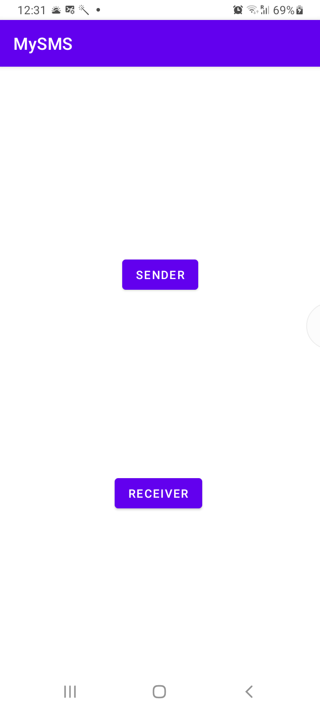
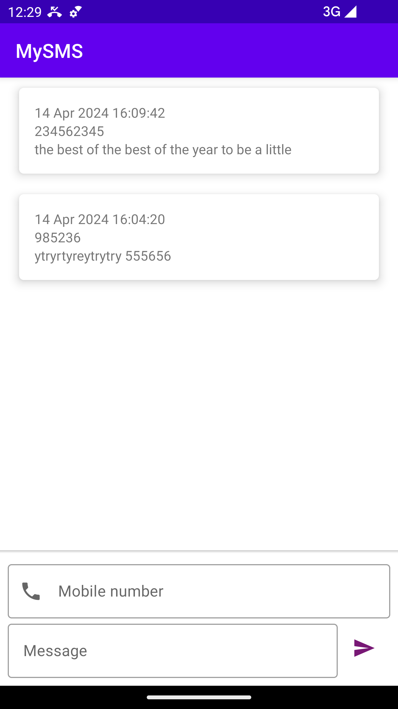
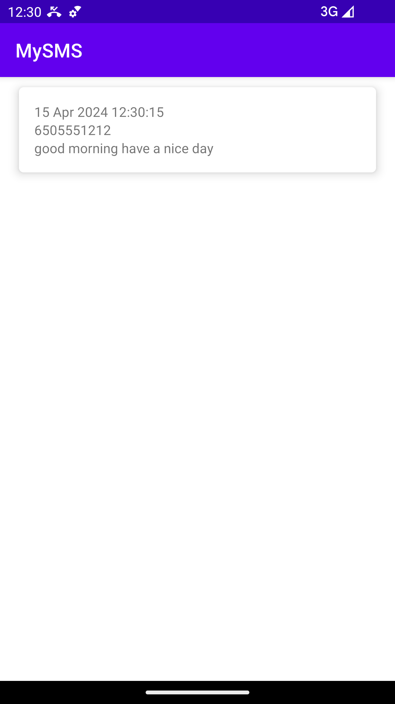

- Dashboard Screen:
  - It features two buttons: one for navigating to the Sender Activity screen and the other for the Receiver screen.
  - The screen also includes permission requests for reading and sending SMS.
- Sender Screen:
  - This screen displays a list of messages sent by the application and provides the ability to send SMS messages.
  - It retrieves messages from the Android ContentResolver.
- Receiver Screen:
  - The Receiver screen shows messages received by the application.
  - Messages are filtered to display only encrypted ones and are retrieved from the Android ContentResolver.

- In Android default SMS app, message will go but it will be encrypted(non readable format).
- In feature we go with listen the incoming message with help background services class

